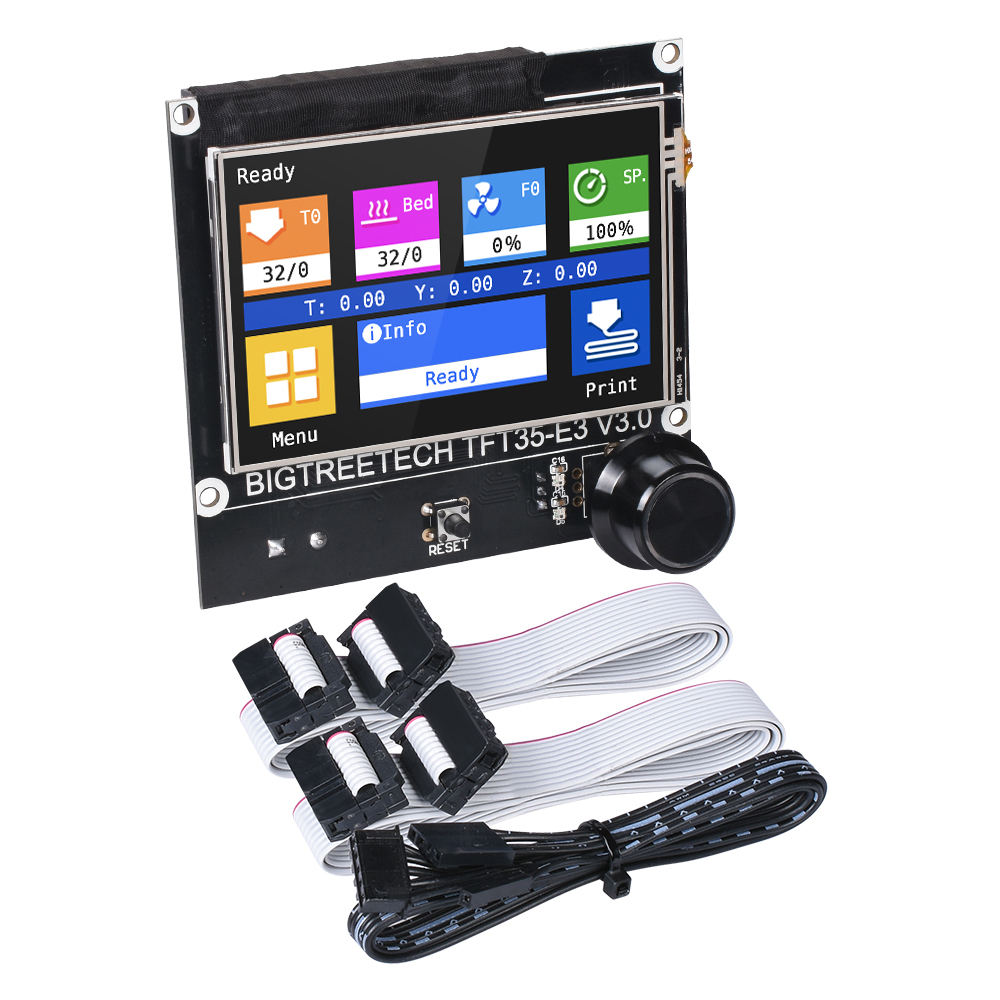
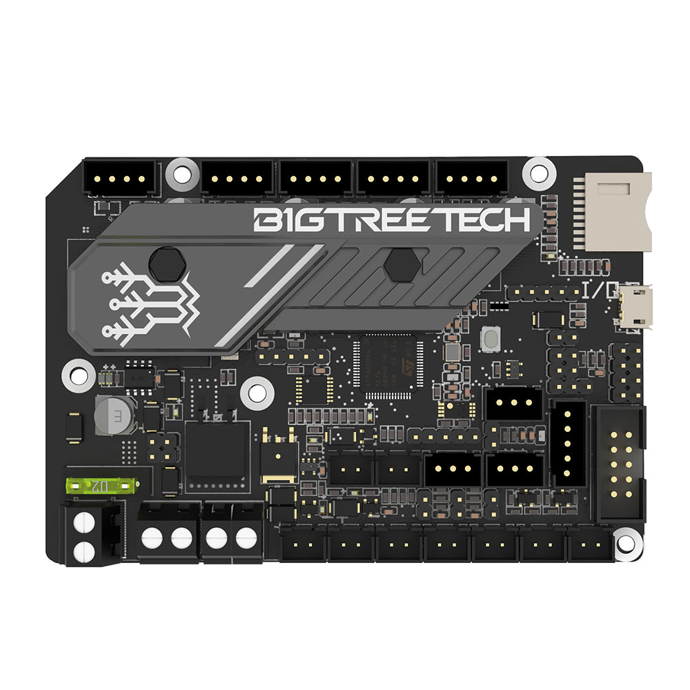

My CR-10 S5 3D printer tuning, improvements, upgrades, setup, configs

## Extruder, Hot end

## BigTreeTech TFT35-E3 V3.0

* https://github.com/bigtreetech/BTT-TFT35-E3-V3.0
* https://youtu.be/swbyu4ZNq9I
* https://youtu.be/3jxoESanLCA

## BigTreeTech SKR Mini E3 3.0

* https://www.youmaketech.com/bigtreetech-skr-mini-e3-v3-0-mainboard-upgrade-for-ender-3/
* https://github.com/YouMakeTech/Marlin-2.0.x_config

### Marlin Firmware

Auto Build Marlin for VScode :
* https://github.com/MarlinFirmware/AutoBuildMarlin
* https://marlinfw.org/docs/basics/auto_build_marlin.html

Example : https://github.com/YouMakeTech/Marlin-2.0.x_config/tree/main/Ender%205%20Pro/BigTreeTech%20SKR%20Mini%20E3%203.0

## Heat pad

## Relay

150A

### Klipper Firmware

Example : https://github.com/YouMakeTech/klipper-ender3/tree/main/config/Ender-3%20Pro/SKR-Mini-E3-V3.0

### Klipper UI

* https://github.com/fluidd-core/fluidd (VUE, TS)
* Mainsail : https://github.com/mainsail-crew/mainsail (VUE, TS)

### Firmware

* https://github.com/bigtreetech/BIGTREETECH-TouchScreenFirmware

## Other ideas

* Wifi monitor ESP32?
* Klipper?
*